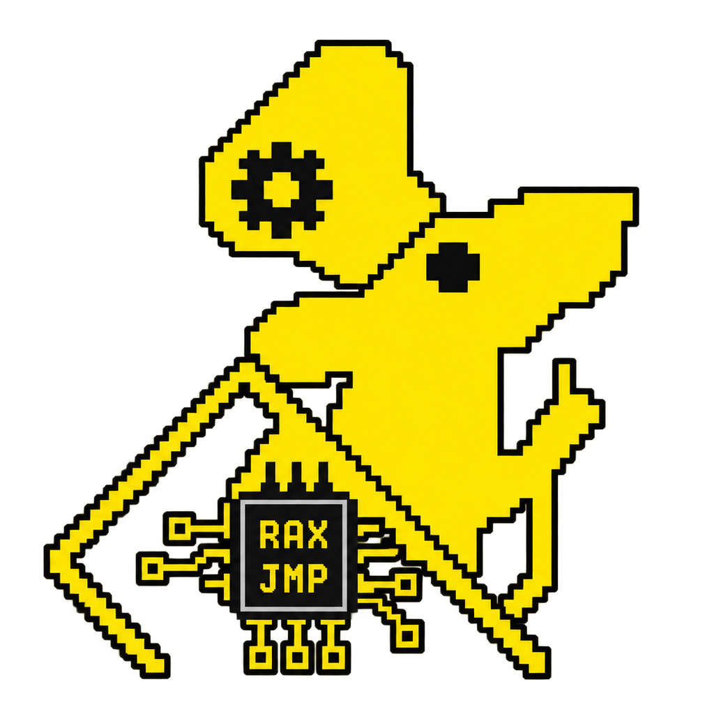

<div align="center">



# ratasm

**A terminal IDE and debugger for x86-64 assembly.**

Write it, assemble it, run it, and watch the CPU while it happens — without
leaving the terminal.

[](https://github.com/tuna4ll/ratasm/actions/workflows/ci.yml)
[](https://crates.io/crates/ratasm)
[](LICENSE)

</div>

---

## What it is

Assembly is not hard because the instructions are complicated. It is hard
because the machine state is invisible. You write `add rax, rbx`, and to know
what happened you need to see two registers, six flags, and the stack — at that
exact instruction, not before or after.

`ratasm` puts those things next to your source. It is not a text editor with a
debugger bolted on; it is a view of the relationship between the code you wrote
and the CPU that is running it.

- **The register panel** highlights what the last instruction changed.
- **The flag panel** tells you which conditional jumps would be taken *right
  now*, given the flags as they stand.
- **The instruction explainer** reads your actual operands: `add rax, rbx`
  becomes `RAX ← RAX + RBX`, with what it reads, what it writes, and which
  flags it touches.
- **The syscall finder** answers "which register does the fourth argument go
  in?" without a browser tab. (`R10`, not `RCX`.)

Nothing is simulated or guessed. Registers and memory come from GDB, the
disassembly comes from a real x86-64 decoder, and the syscall numbers come from
your kernel's own headers. Where `ratasm` does not know something, it says so
rather than inventing a plausible answer.

## Status

This is an honest account of what works today.

| Area | State |
| --- | --- |
| NASM editor: highlighting, symbols, completion, search, undo | Working |
| Build pipeline: `nasm` → `ld`, diagnostics mapped to source lines | Working |
| Running programs: exit codes, signals, timeouts, stdin | Working |
| GDB/MI transport, breakpoints, stepping, registers, memory | Working |
| Disassembler: ELF inspection and x86-64 decoding | Working |
| Instruction explainer, syscall database, flag analysis | Working |
| Terminal UI: panels, responsive layout, command palette | Working |
| Learning mode, scratchpad, clipboard | Not yet |

Everything marked *working* is covered by the test suite — 860 tests, including
ones that assemble and run real programs and drive a real GDB. The two
unfinished features say so when you reach for them rather than doing nothing.

## Installing

```sh
curl -fsSL https://github.com/tuna4ll/ratasm/releases/latest/download/install.sh | sh
```

This downloads the release binary for your machine, verifies its checksum and
installs it into `~/.local/bin`. Set `RATASM_INSTALL_DIR` to put it elsewhere.

Piping a script into a shell is worth being careful about. If you would rather
read it first:

```sh
curl -fsSL -O https://github.com/tuna4ll/ratasm/releases/latest/download/install.sh
less install.sh
sh install.sh
```

### From crates.io

```sh
cargo install ratasm
```

### From source

```sh
git clone https://github.com/tuna4ll/ratasm
cd ratasm
cargo install --path .
```

### System requirements

`ratasm` drives the standard Linux assembly toolchain; it does not bundle one.

| Tool | Needed for |
| --- | --- |
| `nasm` | assembling |
| `ld` (binutils) | linking |
| `gdb` | debugging (everything else works without it) |

```sh
sudo apt install nasm binutils gdb      # Debian, Ubuntu
sudo dnf install nasm binutils gdb      # Fedora
sudo pacman -S nasm binutils gdb        # Arch
```

Linux on x86-64 only, for now. See the [roadmap](#roadmap).

## Your first project

```sh
ratasm new hello
cd hello
ratasm
```

`ratasm new` writes a working, commented `write`/`exit` program — not a stub.
Press <kbd>F6</kbd> to assemble it, <kbd>F5</kbd> to run it, <kbd>F9</kbd> on a
line to set a breakpoint, and <kbd>F7</kbd> to step one instruction at a time
while you watch the registers move.

## Screen layout

Panels adapt to the terminal. Below roughly 100 columns they collapse into
tabs rather than being squeezed into uselessness.

```text
┌─ main.asm ────────────────────────┬─ Registers ──────────────┐
│  7   _start:                      │  RAX  0x000000000000003c │
│  8 ●     mov rax, 1               │  RBX  0x0000000000000000 │
│  9 ▶     mov rdi, 1               │  RSP  0x00007ffd8f2a1b40 │
│ 10       lea rsi, [rel message]   │  RIP  0x00000000004000b7 │
│ 11       syscall                  ├─ Flags ──────────────────┤
│                                   │  ZF ■   would take: je   │
├─ Disassembly ─────────────────────┤  CF □   SF □   OF □      │
│ 4000b0  b8 3c 00 00 00  mov eax,… ├─ Stack ──────────────────┤
│ 4000b7  bf 01 00 00 00  mov edi,… │ →7ffd8f2a1b40  00000001 │
├─ Explain ─────────────────────────┴──────────────────────────┤
│ Effect: RDI ← 1     Writes: RDI     Flags: none              │
└──────────────────────────────────────────────────────────────┘
```

The editor, registers, flags, stack, memory, disassembly, breakpoints, build
output, instruction explanation, syscall finder and symbol explorer are all
panels; <kbd>Tab</kbd> cycles between them.

## Keyboard shortcuts

| Key | Action |
| --- | --- |
| <kbd>F5</kbd> | Run, or continue when paused |
| <kbd>F6</kbd> | Build |
| <kbd>F7</kbd> | Step one instruction |
| <kbd>F8</kbd> | Step over |
| <kbd>F9</kbd> | Toggle breakpoint |
| <kbd>F10</kbd> | Step one source line |
| <kbd>Ctrl</kbd>+<kbd>S</kbd> | Save |
| <kbd>Ctrl</kbd>+<kbd>O</kbd> | Open |
| <kbd>Ctrl</kbd>+<kbd>P</kbd> | Command palette |
| <kbd>Ctrl</kbd>+<kbd>F</kbd> | Search |
| <kbd>Ctrl</kbd>+<kbd>G</kbd> | Go to line or address |
| <kbd>Ctrl</kbd>+<kbd>K</kbd> | Syscall finder |
| <kbd>Ctrl</kbd>+<kbd>Q</kbd> | Quit |
| <kbd>Tab</kbd> / <kbd>Shift</kbd>+<kbd>Tab</kbd> | Next / previous panel (indent / dedent in the editor) |
| <kbd>Alt</kbd>+<kbd>1</kbd>…<kbd>9</kbd> | Focus a panel directly |

All of them are configurable, and conflicting bindings are reported at start-up
rather than silently shadowing one another. See
[docs/keybindings.md](docs/keybindings.md).

## Configuration

Per-project settings live in `.ratasm.toml` beside your source. Every field has
a default, so you only write down what differs.

```toml
[project]
name = "hello"
entry = "src/main.asm"
architecture = "x86_64"
syntax = "nasm"

[build]
assembler = "nasm"
assembler_args = ["-f", "elf64"]
linker = "ld"

[run]
args = []
timeout_ms = 5000        # 0 disables the limit
```

A misspelled key is an error at load time rather than a setting that silently
does nothing. Paths may not escape the project directory. Full reference:
[docs/configuration.md](docs/configuration.md).

Working on a single `.asm` file with no project file works too — `ratasm` uses
the defaults and treats that file's directory as the project root.

## Known limitations

- **Linux x86-64 only.** The architecture is modular — a project file naming
  `aarch64` gets a clear "not supported yet" rather than a confusing failure —
  but only x86-64 and NASM are implemented.
- **NASM syntax only.** GAS is recognised in configuration and not yet handled.
- **Vector instructions are named, not modelled.** `pxor xmm0, xmm1` is
  recognised and described, but the explainer does not simulate per-lane
  behaviour, and says as much.
- **Around sixty syscalls carry full argument documentation.** All 385 are
  searchable by name and number; the rest point you at `man 2`. Inventing
  argument lists would be worse than not having them.
- **Source-level stepping needs debug information.** Build with debug info
  enabled or you get instruction-level stepping only.
- **One debug session at a time.** No multi-threaded target support.

## Security note

**Programs you write in `ratasm` run natively on your machine, with your
privileges.** The scratchpad is a convenience for trying an instruction
quickly; it is *not* a sandbox. There is no isolation, no seccomp filter and no
container. An assembly program can do anything your user account can do.

Do not paste assembly you do not understand into the scratchpad and run it.

The run timeout stops a program that loops forever; it is not a security
boundary. External tools are launched through `execve` with separate arguments
and never through a shell, so paths containing spaces or metacharacters cannot
be turned into command injection.

## Contributing

Contributions are welcome. See [CONTRIBUTING.md](CONTRIBUTING.md) for the
workflow; in short:

```sh
cargo fmt --all
cargo clippy --all-targets --all-features -- -D warnings
cargo test --all-features
```

All three must pass. Tests that need `gdb`, `nasm` or `ld` skip themselves when
those tools are missing, so a partial toolchain will not produce false
failures.

Architecture notes for anyone finding their way around:
[docs/architecture.md](docs/architecture.md).

## Roadmap

- Learning mode: guided exercises on the ABI, the stack and calling conventions
- Scratchpad: set up registers, run one instruction, compare the result
- AT&T syntax rendering throughout, not just in the disassembler
- GAS source support
- AArch64 and RISC-V back ends
- Watchpoints and conditional breakpoints
- Time-travel debugging via GDB's reverse execution

## Licence

MIT. See [LICENSE](LICENSE).

<div align="center">
<sub>Built by <a href="https://github.com/tuna4ll">Tuna Kılıç</a></sub>
</div>
