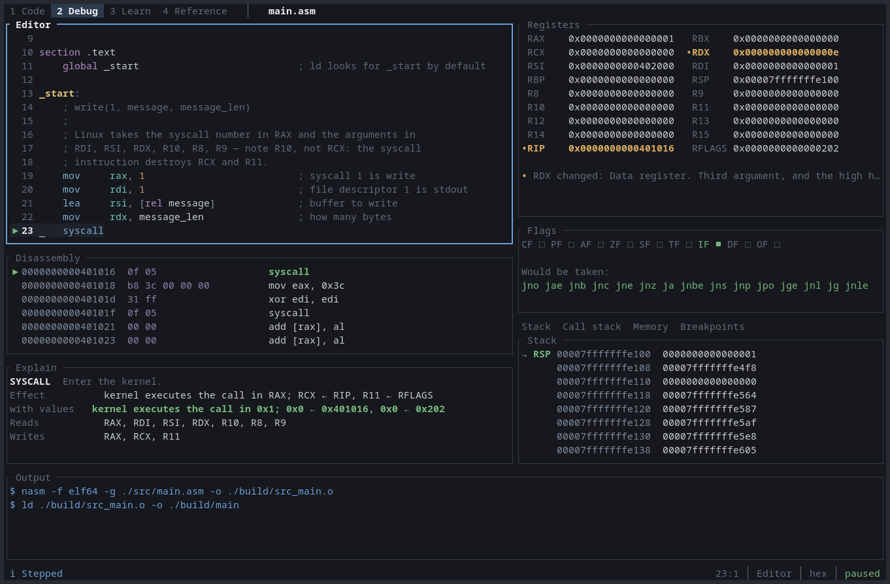
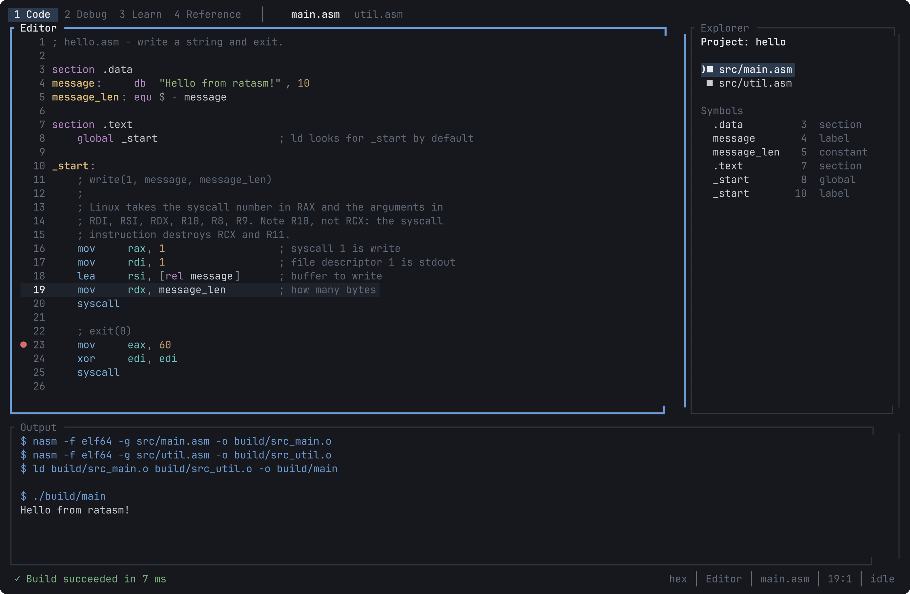
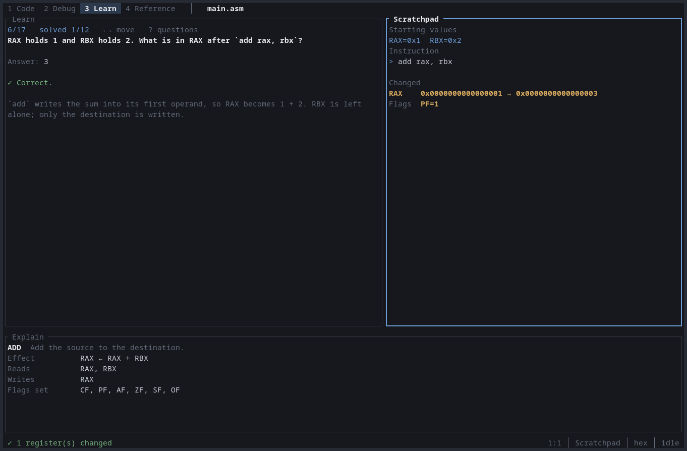
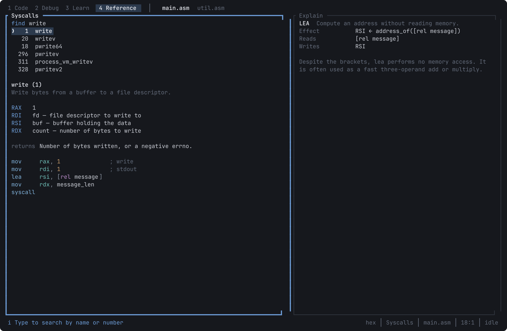

<div align="center">


# ratasm

**A terminal IDE and debugger for x86-64 assembly.**

[](https://github.com/tuna4ll/ratasm/actions/workflows/ci.yml)
[](https://crates.io/crates/ratasm)
[](LICENSE)

</div>



Assembly is hard mostly because the machine state is invisible. You write
`add rax, rbx` and to know what happened you need two registers, six flags and
the stack, at that instruction rather than before or after it.

ratasm puts them next to your source. The register panel marks what the last
instruction changed. The flag panel lists the conditional jumps that would be
taken as the flags stand right now. The explainer reads your actual operands,
so `add rax, rbx` becomes `RAX ← RAX + RBX` with what it reads, writes and
sets. The syscall finder answers which register the fourth argument goes in
(`R10`, not `RCX`).

Registers and memory come from GDB, the disassembly from a real x86-64 decoder,
the syscall numbers from your kernel's headers. Where ratasm does not know
something it says so.

## Install

```sh
curl -fsSL https://github.com/tuna4ll/ratasm/releases/latest/download/install.sh | sh
```

Downloads the release binary for your machine, checks its checksum and installs
it into `~/.local/bin` (`RATASM_INSTALL_DIR` overrides that). To read the script
first, download it, then run `sh install.sh`.

Or `cargo install ratasm`, or clone and `cargo install --path .`.

ratasm drives the standard Linux toolchain rather than bundling one: `nasm` to
assemble, `ld` to link, and `gdb` to debug. Everything except debugging works
without `gdb`.

```sh
sudo apt install nasm binutils gdb      # Debian, Ubuntu
sudo dnf install nasm binutils gdb      # Fedora
sudo pacman -S nasm binutils gdb        # Arch
```

Run `ratasm doctor` to check what is installed. Linux on x86-64 only for now.

## Start

```sh
ratasm new hello
cd hello
ratasm
```

`ratasm new` writes a working, commented `write`/`exit` program rather than a
stub. <kbd>F6</kbd> assembles it, <kbd>F5</kbd> runs it, <kbd>F9</kbd> sets a
breakpoint on the current line, and <kbd>F7</kbd> steps one instruction while
you watch the registers move.

`ratasm file.asm` opens single files, several at once if you name several.

## Pages

The interface is four pages, each holding the panels for one activity.
<kbd>Alt</kbd> plus the number along the top opens one; <kbd>Tab</kbd> moves
between the panels of the page you are on.

| Page | For |
| --- | --- |
| Code | Writing and building: editor, project files, build output |
| Debug | Watching the machine: registers, flags, stack, disassembly |
| Learn | Lessons and questions, with a scratchpad to try them in |
| Reference | Looking up a system call or what an instruction does |

<details>
<summary>Code, Learn and Reference</summary>





</details>

Panels adapt to the terminal. Anything taller than its panel scrolls, with a
scrollbar to say so; the mouse wheel moves whatever it is pointing at. Below
roughly 100 columns a page keeps its main panel and puts the rest behind a tab
strip rather than squeezing a register view into a width where it shows
nothing.

## Keys

| Key | Action |
| --- | --- |
| <kbd>F5</kbd> / <kbd>F6</kbd> | Run or continue / build |
| <kbd>F7</kbd> / <kbd>F8</kbd> / <kbd>F10</kbd> | Step instruction / over / source line |
| <kbd>Shift</kbd>+<kbd>F7</kbd> | Step one instruction backwards |
| <kbd>F9</kbd> | Toggle breakpoint |
| <kbd>F1</kbd> / <kbd>F2</kbd> | Learning panel / scratchpad |
| <kbd>Ctrl</kbd>+<kbd>P</kbd> | Command palette |
| <kbd>Ctrl</kbd>+<kbd>S</kbd> / <kbd>Ctrl</kbd>+<kbd>O</kbd> | Save / open |
| <kbd>Ctrl</kbd>+<kbd>F</kbd> / <kbd>Ctrl</kbd>+<kbd>G</kbd> | Search / go to line or address |
| <kbd>Ctrl</kbd>+<kbd>D</kbd> | Go to definition, across files |
| <kbd>Ctrl</kbd>+<kbd>K</kbd> | Syscall finder |
| <kbd>Alt</kbd>+<kbd>1</kbd>..<kbd>4</kbd> | Open a page |

Every binding is configurable, and conflicts are reported at start-up instead
of silently shadowing one another. Full list:
[docs/keybindings.md](docs/keybindings.md).

## Configuration

Per-project settings live in `.ratasm.toml` beside your source. Every field has
a default, so you write down only what differs.

```toml
[project]
name = "hello"
entry = "src/main.asm"
sources = ["src/util.asm"]

[build]
assembler_args = ["-f", "elf64"]

[run]
timeout_ms = 5000        # 0 disables the limit
```

A misspelled key is an error at load time rather than a setting that quietly
does nothing, and paths may not escape the project directory. Reference:
[docs/configuration.md](docs/configuration.md).

A single `.asm` file with no project file works too: ratasm uses the defaults
and treats the file's directory as the root.

## Security

**Programs you write in ratasm run natively, with your privileges.** The
scratchpad is a convenience for trying one instruction, not a sandbox. There is
no isolation, no seccomp filter, no container. Do not paste assembly you do not
understand into it and run it.

The run timeout stops a program that loops forever; it is not a security
boundary. External tools are launched through `execve` with separate arguments
and never through a shell.

## Limitations

- Linux x86-64 and NASM syntax only. A project file naming `aarch64` or `gas`
  gets a clear "not supported yet" rather than a confusing failure.
- Vector instructions are named and described but not modelled per lane, and
  the explainer says so.
- Around sixty syscalls carry full argument documentation. All 385 are
  searchable; the rest point at `man 2`.
- Source-level stepping needs debug information. Without it you get
  instruction-level stepping.
- One debug session at a time, no multi-threaded targets.
- Stepping backwards needs GDB's recording, which is on by default and costs
  time per instruction. `record = false` turns it off.
- Copying reaches the system clipboard through OSC 52 where the terminal allows
  it, but pasting only sees what ratasm copied: reading the clipboard back is
  not something a terminal reliably permits.
- A program's input and output are captured rather than interactive. `stdin` in
  `.ratasm.toml` supplies fixed input; <kbd>Ctrl</kbd>+<kbd>F5</kbd> stops a
  program that will not stop itself.

## Contributing

```sh
cargo fmt --all
cargo clippy --all-targets --all-features -- -D warnings
cargo test --all-features
```

All three must pass. Tests needing `nasm`, `ld` or `gdb` skip themselves when
those are missing. Workflow: [CONTRIBUTING.md](CONTRIBUTING.md). Architecture
notes: [docs/architecture.md](docs/architecture.md).

## Roadmap

Watchpoints and conditional breakpoints, a pseudo-terminal so interactive
programs can be debugged, AT&T syntax throughout, GAS source support, more
lessons, and AArch64 and RISC-V back ends.

## Licence

MIT. See [LICENSE](LICENSE).

<div align="center">
<sub>Built by <a href="https://github.com/tuna4ll">Tuna Kılıç</a></sub>
</div>
